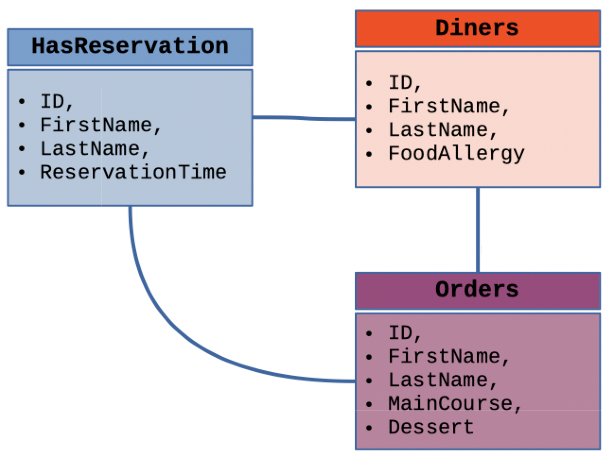

# Database Systems (CS305) Lab 5 Assignment

Designing a restaurant reservation schema

**Assigned** : Thursday 18 October 2023

**Due** : Thursday 26 October 2023


Figure 1: The simplified diagram of the RestaurantDB database. The primary and foreign key information has been left out of this diagram. Part of your task is to design these keys.

## Project Goals

The main goals of this work include the following.

* To demonstrate proficiency in applying primary and foreign keys
* To apply constraints strategically to prevent user-initiated errors in data
* To gain experience writing detailed SQL code to add structure and security to a database.

## Introduction

During our study of primary and foreign keys, we have discussed how primary keys are used to establish non-redundancy in tables where they are implemented. In our discussion of foreign keys, we have discussed how these keys are used to maintain strict relationships between different tables. In this lab, we we further this discussion by demonstrating how these keys can be used to establish non-redundancy and strict relationships for a database which is built to store reservation information for restaurants.

## The Restaurant Database

We will be building a database that has been designed for a restaurant which takes reservations on a daily basis for diners who come to eat. The database will have three tables;

### Tables

Tables contain the attributes which are shown in Figure 1.

1. Table `HasReservation`: Contains an attributes for diners’ unique identifiers, the first and last names, and the times of their reservations in the restaurant.

2. Table `Diners`: Contains the first and last names, in addition to information about food allergies for all the people in the party of the customer who is holding the dinner reservation. Note: This table can only be populated once the `HasReservation` table contains the name of a member of the party who holds a reservation.

3. Table `Orders`: Contains attributes for diners first and last names, in addition to information about the dishes that each person in the party will order. For instance, each person is sure to have a dessert and so this information would be kept in the `dessert` attribute of this table. There are also attributes to contain information about *hors d'oeuvres*, *entrez platters*, fruit-drinks and what kinds cheese to have some the cheese plate (*Brie*, *Camembert*, *Roquefort*, *Goats cheese*, etc.) Note: this table cannot be populated until the `Diners` table has been correctly populated with name of the dinner-goer.

### Usage

The simplified diagram for the restaurant’s database can be found in Figure 1. The database is used in the following way; when a diner (the *customer*) makes a reservation to be seated in the restaurant for dinner, the restaurant’s database administrator places the customer's name in the `HasReservation` table. The administrator also records the requested time for a reservation in one of the table's attributes. Please note: No other tables may be populated for the customer until the customer's name is in the `HasReservation` table.

When the dining party arrives at the restaurant for their reservation time, the host will have knowledge of the unique identifier for each person. The host will then populate the `Diners` Table with the names of the party members who are associated with the reservation holder. The host will also ask each person about any food allergies. Any food allergy information is to be recorded by the `Diners` Table attribute, `foodAllergy`.

The server who takes the order from each of the diners will populate another table, `Orders`, which stores with the a unique identifier of each person, and the first and last names of each member of the party. In addition, the `Orders` table will also contain two attributes to record the `mainCourse` and `dessert` of people in the party. This table can only be populated when there is already a reservation for the diner for one of the people in the group.

**Please note, that this table can only be populated when there is already a reservation for one of the people inthe dining party.**

## The Build File

Your task is to design and implement this database system for the restaurant from scratch. You will have to create all tables and use primary and foreign keys where appropriate. In addition you are to generate some data to showchase the database in action. We note that the primary keys of each table are to be used to ensure that there is no redundancy in the database, and the foreign keys are to be used to ensure that certain relationships are made before particular tables may be populated, as described above.

Your main deliverable will be a builder file t create the database, and some implemented data to populate it to demonstrate your completed and working restaurant database.

## Queries

The other part of your task is to demonstrate the functionality of your keys. For this, you will write four queries of your choice to demonstrate how the primary and foreign keys function to unite your tables and structure your database.

Showcase your database by providing seven questions and their query-solutions. For each queries, please connect at least two tables. Please add your questions and their corresponding queries and output to the file, `writing/queries.md`.

---

## Deliverables

Summary of the Required Deliverables
Please submit your work by pushing it to your GitHub Classroom repository.

1. **Reflection document**: You will modify the file `writing/reflection.md` to respond questions in the document.

2. **Database-building file**: You will submit your edited build file (`src/DB_build.txt`) to be used to build your database from your obtained data files.

4. **Query file**: This file contain three or four queries to demonstrate the functionality of your database. Please be creative in your thinking so as to emulate an actual query that a restaurant may use when working with your database system. Please use Markdown in the file, `writing/queries.md`.

Note: If you would like to add screenshots to your work, please use the the following Markdown code;

```

```

The following html code serves to scale-down your graphic.

```

```

## Technical Information

### Git

Practicing software developers normally use a version control system to manage most of the artifacts produced during the phases of the software development life cycle.

In this course, we will always use the `git` distributed version control system to manage the files associated with our course. In particular, we will use this secure resource to submit our all our assignments and projects.

To help you get started with installing course software, our course [resources page](https://www.oliverbonhamcarter.com/resources/), contains URL links to download sites and important tutorials.

Note, if you are using a Mac or Linux machine, you may already have this software installed; try typing `git` at your terminal to check. On a MacOS machine, this command will ask you whether you wish to install `xCode`. Please follow the steps to install.

 If you are using a Windows machine then it is likely that you will need to install the software. Ask a Technical Leader or your instructor for help as necessary.

### Create your account on GitHub

It is assumed that you already have an account on GitHub but if you do not, then please visit [github.com](http://www.github.com) to create your account using your Allegheny email address. Follow the account generation links to create an account on GitHub using a normal name (to identify you) and be sure to add a current photo of yourself when completing your profile.

### Add Your SSH Keys to your account

SSH keys allow you to interact with GitHub using secure means. Using these keys, you can conveniently push and pull data from GitHub without having to input your user name and password each time. When developing code, it will be desirable to make frequent pushes to GitHub with your code so that any problems or bugs, can be isolated with the development of specific parts of code.

To learn more about creating and adding your ssh keys to your GitHub account. Please visit https://www.ssh.com/ssh/keygen/ to learn how to set-up your security keys. Let the instructor know if you have any questions with this task. For more information about ssh keys, please watch Professor Luman’s SSH Key [video](https://www.youtube.com/watch?v=qEPjUGQFmzQ&list=PLsYZRXov75ZHSwWiCk0-jd1RcTuu_-zmD).

### Submitting Assignments
As you are working on your lab, you are to commit and push regularly. The commands are the following.

```
git add -A
git commit -m ‘‘Your notes about commit here’’ 
git push
```

## Project Assessment

The grade that a student receives on this assignment will have the following components.

* **GitHub Actions CI Build Status [up to 25%]:**: For the lab repository associated with this assignment students will receive a checkmark grade if their last before-the-deadline build passes. This is only checking some baseline writing and commit requirements as well as correct running of the program. An additional reduction will given if the commit log shows a cluster of commits at the end clearly used just to pass this requirement. An addition reduction will also be given if there is no commit during lab work times. All other requirements are evaluated manually.

* **Mastery of Technical Writing [up to 50%]:**: Students will also receive a checkmark grade when the responses to the writing questions presented in the deliverable Files of the directory `writing/` that reveal a proficiency of both writing skills and technical knowledge. To receive a checkmark grade, the submitted writing should have correct spelling, grammar, and punctuation in addition to following the rules of Markdown and providing conceptually and technically accurate answers.

* **Mastery of Technical Knowledge and Skills [up to 25%]**: Students will receive a portion of their assignment grade when their program implementation reveals that they have mastered all of the technical knowledge and skills developed during the completion of this assignment. As a part of this grade, the instructor will assess aspects of the programming including, but not limited to, the completeness and the correctness of the program and the use of effective source code comments.

## GatorGrade

### Checks for GatorGrade

For immediate feedback on submissions, we will be using Gator Grade to inform the of missing components in the submission. As you submit, you will notice that there is a thick red X that will change to a green check mark when all components have been included in the submission. You are encouraged to click on the red X to find a listing of the components to address.

You can check the baseline writing and commit requirements for this lab assignment by running department's assignment checking `gatorgrade` tool. To use `gatorgrade`, you first need to make sure you have Python3 installed (type `python --version` to check). If you do not have Python installed, please see:

- [Setting Up Python on Windows](https://realpython.com/lessons/python-windows-setup/)
- [Python 3 Installation and Setup Guide](https://realpython.com/installing-python/)
- [How to Install Python 3 and Set Up a Local Programming Environment on Windows 10](https://www.digitalocean.com/community/tutorials/how-to-install-python-3-and-set-up-a-local-programming-environment-on-windows-10)

Then, if you have not done so already, you need to install `gatorgrade`:

- First, [install `pipx`](https://pypa.github.io/pipx/installation/)
- Then, install `gatorgrade` with `pipx install gatorgrade`

Finally, you can run `gatorgrade`:

`gatorgrade --config config/gatorgrade.yml`

## Seeking Assistance

* Extra resources for using markdown include;
  + [Markdown Tidbits](https://www.youtube.com/watch?v=cdJEUAy5IyA)
  + [Markdown Cheatsheet](https://github.com/adam-p/markdown-here/wiki/Markdown-Cheatsheet)
* Do not forget to use the above git commands to push your work to the cloud for the instructor to grade your assignment. You can go to your GitHub repository using your browser to verify that your files have been submitted. Please see the TL’s or the instructor if you have any questions about assignment submission.

Students who have questions about this project outside of the lab time are invited to ask them in the course's Discord channel or during instructor's or TL's office hours.
